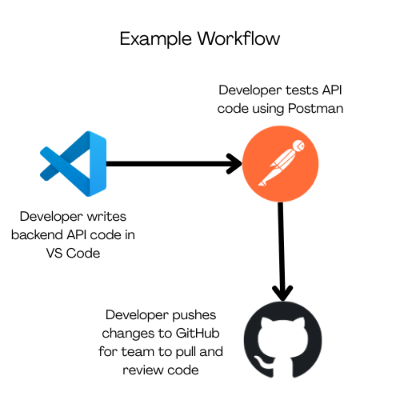

<style>
    h2, h3 {
    color: #215e67ff; /* purple theme you’re using */
    }

    code {
    background: #122534ff;
    padding: 2px 5px;
    border-radius: 6px;
    }

    blockquote {
    border-left: 4px solid #112c56ff;
    background: #ffffffff;
    padding: 10px 15px;
    border-radius: 6px;
    }
</style>

# Using Coding Tools in a Team

## Goals
- Learn to use VS Code, GitHub, and Postman effectively  
- Learn how to collaborate with a team using these tools  

### Tools Overview

### 📝 VS Code  
A free code editor made by Microsoft.  
**Why teams use it:** It’s lightweight, customizable, and supports real-time collaboration.

- Uses:
    - Writing/Editing code in various coding languages
    - Debugging code
    - Using extensions for various purposes
    - Live collaboration with Live Share

### 💻 GitHub  
A platform for hosting and managing code using **Git**, a version control system.  
**Why teams use it:** It keeps project history safe, lets teammates work on features separately, and makes it easy to review and merge changes.  

- Uses:
    - Version control: Track and manage changes in code history
    - Collaboration: Multiple people are able to work on the same project without overwriting others work
    - Branching and Pull Requests: Add code safely and merge it into the main project

### 📡 Postman  
An API development and testing tool.  
**Why teams use it:** It allows backend and frontend developers to test, share, and debug APIs without writing extra code first.  

- Uses:
    - Sending requests (GET, POST, PUT, DELETE) to an API (your own or one off the internet)
    - Checking responses (JSON, XML, HTML, etc.)
    - Debugging backend services prior to merging with group code / connecting to frontend

### Using These Tools Together

VS Code --> Writing the code (frontend, backend, APIs)

GitHub --> Storing and sharing the code - where you get your team's code and where you give your team code

Postman --> Testing APIs and ensuring backend functionality before connecting it to frontend



### GitHub Basics  

1. **Set up a repository**  
   - Create a New Repository on GitHub  
   - Add teammates as collaborators or have them fork it  
   - Clone into VS Code:  
     ```bash
     git clone <URL>
     ```  

2. **Common Commands**  
   ```bash
   git pull         # Get the latest changes from GitHub  
   git add .        # Stage your changes  
   git commit -m "Message"  # Save your changes locally  
   git push         # Upload changes to GitHub  
   git stash        # Temporarily save changes to avoid conflicts  
   git stash pop    # Restore stashed changes 

> 💡 Always pull (`git pull`) before pushing new changes to avoid conflicts.  

### Practice

1. VS Code
    - Create a file in VS Code
    - Install an extension
    - Use Live Share with a team member to edit code

2. GitHub
    - Create a repository on GitHub
    - Clone it into VS Code
    - Make a branch, edit a file, and push changes
    - Open a pull request (under contribute) and review another person's changes

3. Postman
    - Open Postman and send a request (GET) to a public API (find one on the internet)
    - Inspect the JSON response

> Hacks:
> Be able to work on files in VSCode,
> manage versions with GitHub and be able to push and pull,
> test APIs in Postman